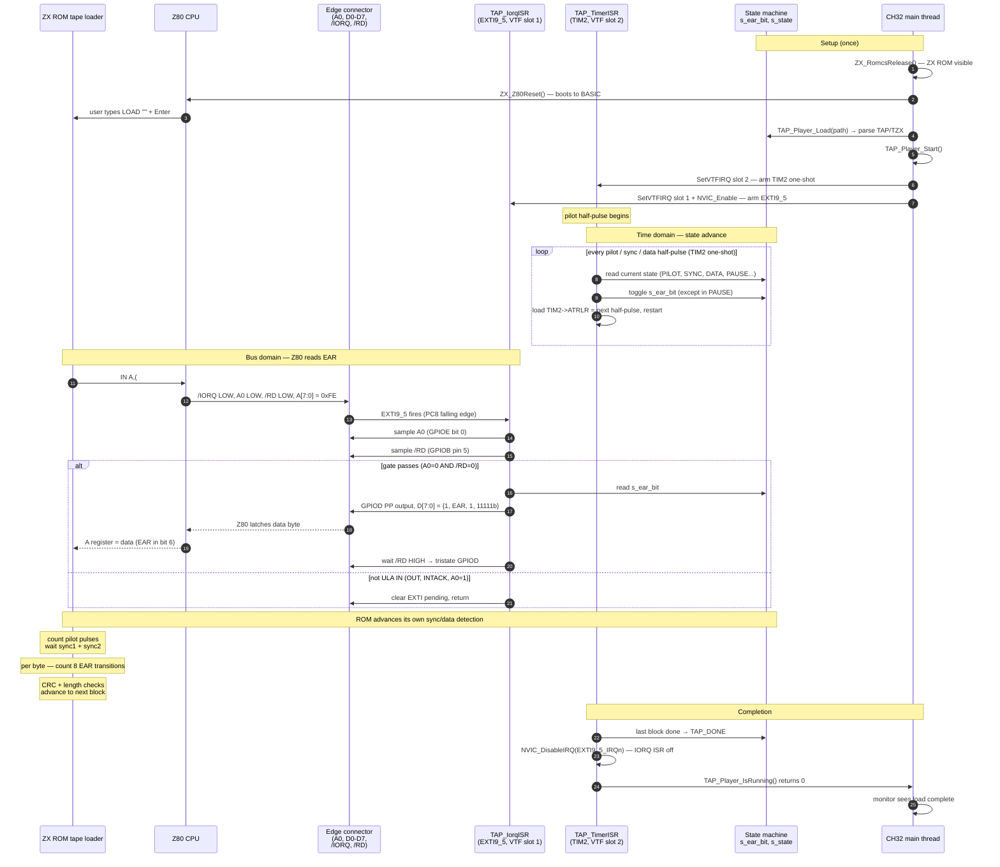

# Tape Player — TAP and TZX Playback

This document explains how `.tap` and `.tzx` tape image files are loaded and
played back, and how the EAR signal is injected onto the ZX Spectrum data bus
by the CH32V307 cartridge MCU.

---

## Hardware overview

The ZX Spectrum reads the cassette EAR signal via an `IN A,(#FE)` instruction.
The ULA drives the data bus with the current tape level on **bit 6**.  The
cartridge exploits this by intercepting every `IN A,(#FE)` and driving the
data bus itself with the current playback state.

| Signal | GPIO         | Direction    | Purpose                                      |
|--------|--------------|--------------|----------------------------------------------|
| /IORQ  | GPIOC Pin 8  | Input floating → EXTI9_5 trigger | Fires on every I/O cycle  |
| /RD    | GPIOB Pin 5  | Input floating | Distinguishes IN from OUT / INTACK           |
| A0     | GPIOE Pin 0  | Input floating | Low = ULA port (tape/keyboard); high = other |
| Data   | GPIOD[7:0]   | Input / output PP | Driven during IN A,(#FE) only           |

**Key principle**: the CH32 does not generate an audio signal — it drives the
Z80 data bus directly.  When the Spectrum ROM tape loader executes
`IN A,(#FE)`, the CH32 asserts the data bus with the current EAR bit value.
The ROM loader reads the bit and advances its own sync/data detection logic
exactly as it would from a real tape.

> **Bus-contention note**: the ULA also drives the data bus during
> `IN A,(#FE)`.  While the IORQ ISR is active there is a brief period of
> contention between the CH32 push-pull output and the ULA output.
> This is an experimental implementation; it is tolerable on hardware that
> accepts brief contention, but not guaranteed safe on all boards.

---

## File formats

### TAP

A `.tap` file is a sequence of raw TAP blocks with no global header.
Each block is:

```
Offset  Size  Content
  0       2   Block length N (little-endian, does not include these 2 bytes)
  2       N   Block data (first byte is the ZX flag byte: 0x00=header, 0xFF=data)
```

The flag byte determines the pilot pulse count:
- `0x00` (program/header block): **8064 full pilot pulses**
- any other value (data block): **3220 full pilot pulses**

### TZX

A `.tzx` file begins with the 10-byte global header:

```
Offset  Size  Content
  0       7   "ZXTape!" (ASCII, no null terminator)
  7       1   0x1A (end-of-text marker)
  8       1   Major version (must be 1)
  9       1   Minor version
```

followed by a sequence of typed blocks.  The player supports:

| Block ID | Name               | Handling                             |
|----------|--------------------|--------------------------------------|
| `0x10`   | Standard speed data | Converted to a TAP block in memory  |
| `0x20`   | Pause              | Skipped (converted blocks carry their own inter-block pause) |
| `0x21`   | Group start        | Skipped (metadata)                   |
| `0x22`   | Group end          | Skipped (metadata)                   |
| `0x30`   | Text description   | Skipped (metadata)                   |
| `0x31`   | Message block      | Skipped (metadata)                   |
| `0x32`   | Archive info       | Skipped (metadata)                   |
| `0x33`   | Hardware type      | Skipped (metadata)                   |
| `0x35`   | Custom info        | Skipped (metadata)                   |
| `0x5A`   | Glue block         | Skipped                              |
| any other | Turbo / pure tone / CSW / direct | **Rejected** — load fails |

TZX conversion is performed in-place inside the 50 KB tape buffer
(`TAP_ConvertTzxInPlace`): standard-speed blocks (`0x10`) are rewritten as
plain TAP blocks at the start of the buffer, metadata blocks are discarded,
and the resulting TAP stream length is stored in `s_tap_total`.

---

## Tape timing

All timings are expressed in **Z80 T-states at 3.5 MHz**.

| Signal segment      | Duration (T-states) | TIM2 ticks (×20) |
|---------------------|--------------------:|------------------:|
| Pilot half-pulse    | 2168                | 43 360            |
| Sync first half     |  667                | 13 340            |
| Sync second half    |  735                | 14 700            |
| Bit-0 half-pulse    |  855                | 17 100            |
| Bit-1 half-pulse    | 1710                | 34 200            |
| Inter-block pause   | ~1 s (≈1660 pilot-half intervals) | — |

**Timer clock**: TIM2 prescaler = 1 (÷2) → 144 MHz / 2 = **72 MHz**.  One
T-state ≈ 72 MHz / 3.5 MHz = **20.57 ticks**, rounded to 20.  The resulting
~3 % timing error is well within the ±10 % tolerance of the ZX ROM tape
loader.

Each bit is transmitted as **two equal half-pulses**: EAR toggles at the start
of the first half and again at the start of the second half.  Bits are sent
**MSB first** within each byte.

---

## State machine

`TAP_TimerISR` (TIM2 one-shot update interrupt, VTF slot 2) drives the
following state machine.  On every fire:
1. The current EAR level (`s_ear_bit`) is toggled (except during `TAP_PAUSE`).
2. The next one-shot period is loaded and TIM2 is restarted.

```
           TAP_IDLE
               │  TAP_Player_Start() + TAP_NextBlock()
               ▼
           TAP_PILOT  ─── decrement s_pilot_half_rem
               │             (8064 × 2 or 3220 × 2 half-pulses)
               │  last half-pulse
               ▼
           TAP_SYNC1  ──► TAP_SYNC2
                               │
                               ▼
                      TAP_DATA_FIRST_HALF ◄────────────────┐
                               │                           │
                               ▼                           │ next bit
                      TAP_DATA_SECOND_HALF ─── advance bit─┘
                               │
                               │  block exhausted
                               ▼
                           TAP_PAUSE  ─── count down ~1 s
                               │
                ┌──────────────┴──────────────┐
                │  more blocks                │  no more blocks
                ▼                             ▼
            TAP_PILOT                     TAP_DONE
                                          (ISRs disabled)
```

---

## Two-ISR architecture

### TAP_TimerISR — EAR signal generator

- **Interrupt**: TIM2 update (one-shot mode), **VTF slot 2**, priority 2.
- **Responsibility**: advance the state machine and toggle `s_ear_bit`.
- **Never** touches the data bus — it only updates the `s_ear_bit` variable.
- Arms the next one-shot by writing `TIM2->ATRLR` and setting `TIM_CEN`.

### TAP_IorqISR — Bus injection

- **Interrupt**: EXTI9_5 on PC8 (`/IORQ` falling edge), **VTF slot 1**, priority 1.
- **Fires** on every Z80 I/O cycle — both IN and OUT.
- **Gate condition**: A0=0 (GPIOE bit 0 low) AND /RD=0 (GPIOB Pin 5 low).
  - A0=0 selects the ZX ULA port `0xFE` (tape + keyboard + border).
  - /RD=0 means this is an `IN` instruction, not `OUT` or interrupt-acknowledge.
- If the gate passes, drives the full 8-bit data bus:

```
Bit 7   1  (reserved / always 1)
Bit 6   s_ear_bit  ← current tape EAR level
Bit 5   1  (reserved / always 1)
Bits 4-0  1  (keyboard rows — all keys reported as not pressed)
```

- Holds the bus driven until `/RD` deasserts, then tristates `GPIOD`.
- If the gate does not pass (OUT, INTACK, or wrong port), just clears the EXTI
  flag and returns immediately.

**Data bus drive sequence**:
```c
GPIOD->CFGLR = 0x33333333;          /* all 8 pins → push-pull output */
GPIOD->OUTDR = (GPIOD->OUTDR & ~0xFF) | data;
while ((GPIOB->INDR & ZX_PIN_RD) == 0) {}   /* hold for duration of read */
GPIOD->CFGLR = 0x44444444;          /* all 8 pins → floating input   */
```

---

## Two-ISR interaction (sequence diagram)

The player runs **two cooperating ISRs**:

- `TAP_TimerISR` (TIM2, VTF slot 2) — *time domain*: advances the state
  machine and toggles `s_ear_bit` at every pilot/sync/data half-pulse.
- `TAP_IorqISR` (EXTI9_5, VTF slot 1) — *bus domain*: drives the current
  `s_ear_bit` onto D0–D7 when the Z80 actually reads `IN A,(#FE)`.

They share **only** the `s_ear_bit` variable — no queue, no lock.  The
TIM2 ISR is responsible for keeping `s_ear_bit` valid; the IORQ ISR
samples it atomically on each Z80 read.



**Why two ISRs and not one?**  The TIM2 ISR is purely a time reference
(it never touches the bus, so it can never collide with the ULA); the
IORQ ISR is purely a bus reaction (it cannot predict the next Z80 read).
A single ISR that did both would have to either guess when the next
half-pulse should end *and* race the ULA for the bus every time, or
block both domains inside one critical section.  Splitting them along
the time/bus axis removes the contention entirely at the cost of a
single shared byte (`s_ear_bit`).

---

## Usage sequence

```
CH32                              Z80 (Spectrum ROM)
─────────────────────────────────────────────────────
ZX_RomcsRelease()           →  ZX ULA ROM appears at 0x0000
ZX_Z80Reset()               →  Z80 boots to BASIC prompt
                               User types: LOAD ""
TAP_Player_Load(path)
                               User presses Enter on UART console
TAP_Player_Start()          →  TIM2 one-shot starts; pilot tone begins
                               IORQ ISR armed
                               ROM tape loader executes IN A,(#FE) loop
                               ISR drives EAR bit per state machine
                               ROM detects pilot → sync → data
                               Program loads into RAM
(TAP_Player_IsRunning() → 0)   Load complete; ISRs disabled automatically
```

> `TAP_Player_IsRunning()` returns 0 when `TAP_DONE` is reached or
> `TAP_Player_Stop()` is called.  The caller in `zx_monitor` polls this to
> know when it is safe to proceed.

---

## Buffer and file limits

| Parameter         | Value        | Notes                                      |
|-------------------|--------------|--------------------------------------------|
| `TAP_BUF_SIZE`    | 50 KB        | Covers a complete standard 48 K game .tap  |
| Max TZX block 0x10 data per block | 65535 bytes | 16-bit length field |
| Pilot count (header block) | 8064 full pulses | = 16128 half-pulses |
| Pilot count (data block)   | 3220 full pulses | = 6440 half-pulses  |

Files larger than 50 KB are **truncated** with a warning; the player proceeds
with whatever data was read.

---

## Files involved

| File | Role |
|------|------|
| [User/tape_player.c](../User/tape_player.c) | Full implementation: TZX converter, state machine, both ISRs, public API |
| [User/tape_player.h](../User/tape_player.h) | Public API and architecture overview |
