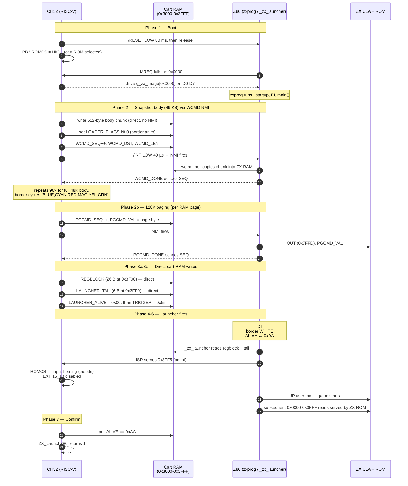
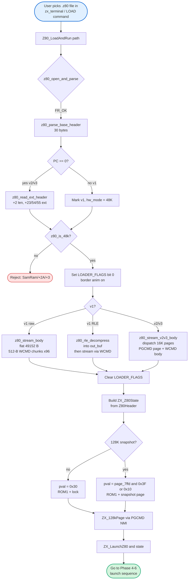

# Z80 Snapshot Launch Mechanism

This document explains, step by step, how a `.z80` snapshot is loaded and
launched on the ZX Spectrum by the CH32V307 cartridge MCU.

Supported snapshot formats:
- **v1** — 30-byte header, flat 49152-byte body (optionally RLE-compressed).
- **v2** — 30-byte base header + 2-byte ext-len + 23-byte ext header + paged blocks.
- **v3** — 30-byte base header + 2-byte ext-len + 54/55-byte ext header + paged blocks.

Hardware modes: 48 K and 128 K/+2 are supported; SamRam, +2A/+3 are rejected.

For the complete CH32↔Z80 pin map (GPIOE / GPIOD / GPIOB / GPIOC assignments,
modes, and active levels), see [zx_bus.md — Hardware connections](zx_bus.md#hardware-connections).

**Key principle**: while ROMCS is driven HIGH by the CH32, the cartridge ROM
(`zxprog`) appears at addresses `0x0000–0x3FFF`.  The cartridge also has a 4 KB
RAM window at `0x3000–0x3FFF` that both the Z80 and the CH32 can access
simultaneously (Z80 via bus, CH32 via `state_pointer->ram[]`).

---

## Phase 1 — Boot: zxprog starts

1. CH32 initialises, configures ROMCS as **push-pull output HIGH**.
2. CH32 pulses `/RESET` LOW for 80 ms then releases it (`ZX_Z80Reset`).
3. Z80 fetches its first opcode from address `0x0000`.  Because ROMCS is HIGH,
   the CH32 cart ISR (`RunCartWithRAM`) serves the byte from `g_zx_image[]`
   (the compiled `zxprog` binary).
4. `zxprog` runs `_startup` (crt0.s):
   - Sets border YELLOW.
   - Enables interrupts (`EI`).
   - Jumps to `main()`.
5. `main()` calls `zx_startup_clear()` — clears all 48 KB of ZX RAM
   (`0x4000–0xFFFF`) and fills the attribute area (`0x5800–0x5AFF`) with
   white paper — then sets border GREEN and enters the **poll loop**.

After ~1200 ms the CH32 returns from `ZX_Z80Reset` and starts the monitor.

---

## Phase 2 — ROM body streaming via NMI mailbox

The CH32 cannot write directly to ZX RAM (it has no DMA to the Z80 bus).
Instead it uses an NMI-based mailbox protocol shared with `zxprog`.

Every NMI command follows the same handshake pattern:
1. CH32 fills the command fields, then atomically increments `*_SEQ`.
2. CH32 pulses the `/INT` line LOW for 40 µs → **NMI fires on Z80**.
3. `_nmi_wrapper` (crt0.s) saves all registers and calls `nmi_handler_c()`.
4. `nmi_handler_c()` dispatches to the appropriate poll handler, executes
   the command, and echoes `*_SEQ` to `*_DONE`.
5. CH32 polls `*_DONE == *_SEQ` to confirm completion.

**Write-command (WCMD) mailbox** — copies data from CH32 into ZX RAM:

```
0x302E  WCMD_SEQ   — CH32 increments to request a write
0x302F  WCMD_DONE  — zxprog echoes SEQ when copy is done
0x3030  DST_LO/HI  — target address in ZX RAM
0x3032  LEN_LO/HI  — byte count (max 512 per chunk)
0x3034  DATA[512]  — payload bytes
```

During snapshot body transfer (`ZX_BusWriteBlock` → `ZX_NmiWriteBlockInternal`)
the CH32 first sets `LOADER_FLAGS` (`0x3F11`, bit 0) to enable the border
animation, and clears it afterwards.  While the flag is set, `wcmd_poll()`
cycles the border through `{BLUE, CYAN, RED, MAGENTA, YELLOW, GREEN}` on each
chunk to provide a visual loading indicator.  The 49 152-byte body
(`0x4000–0xFFFF`) is streamed in 512-byte chunks.

**Paging-command (PGCMD) mailbox** — issues an `OUT (0x7FFD), n` on the Z80:

```
0x302A  PGCMD_SEQ  — CH32 increments to request an OUT
0x302B  PGCMD_DONE — zxprog echoes SEQ when OUT is done
0x302C  PGCMD_VAL  — byte to write to port 0x7FFD
```

Used during v2/v3 128 K body loading to bank in each RAM page before writing
it via WCMD, and once more at the end of loading to lock the correct final
paging state before the launcher fires (see Phase 3c).

**Read-command (RCMD) mailbox** — reads ZX RAM back to CH32:

```
0x3F20  RCMD_SEQ   — CH32 increments to request a read
0x3F21  RCMD_DONE  — zxprog echoes SEQ when copy is done
0x3F22  RCMD_SRC_LO/HI — source address in ZX RAM
0x3F24  RCMD_LEN   — byte count (max 64 per chunk)
0x3F40  RCMD_BUF[64]   — data returned by zxprog
```

**Key mailbox** (ZX → CH32) — reports Z80-side key presses:

```
0x3028  KEY_SEQ    — zxprog increments when a key is pressed
0x3029  KEY_CODE   — ASCII code of the pressed key
```

---

## Phase 3 — Preparing the launcher

Before triggering the jump, the CH32 writes three data structures to the **cart
RAM** window (`0x3000–0x3FFF`) and configures the Z80's interrupt-paging port.
Phases 3a and 3b use `ZX_CartRamWriteBlock` (direct write to
`state_pointer->ram[]`, no NMI needed); Phase 3c uses the PGCMD NMI mailbox.

### 3a — Regblock (`0x3F90`, 26 bytes)

Contains all Z80 CPU registers in the exact order that `_zx_launcher` (crt0.s)
consumes them via a `LD SP, #0x3F90` / `POP` sequence:

| Offset | Bytes    | Loaded by                         |
|--------|----------|-----------------------------------|
| +0x00  | C', B'   | `POP BC` → `EXX` → BC'           |
| +0x02  | E', D'   | `POP DE` → `EXX` → DE'           |
| +0x04  | L', H'   | `POP HL` → `EXX` → HL'           |
| +0x06  | F', A'   | `POP AF` → `EX AF,AF'` → AF'     |
| +0x08  | IXl, IXh | `POP IX`                          |
| +0x0A  | IYl, IYh | `POP IY`                          |
| +0x0C  | 0x00, I  | `POP AF` → `LD I,A` (A = I value)|
| +0x0E  | border, R_comp | `POP BC` → `OUT(0xFE),C`; `LD R,B` |
| +0x10  | C, B     | `POP BC` → main BC                |
| +0x12  | E, D     | `POP DE` → main DE                |
| +0x14  | L, H     | `POP HL` → main HL                |
| +0x16  | F, A     | `POP AF` → main AF                |
| +0x18  | SPl, SPh | `LD SP,(0x3FA8)` → user SP        |

**R register compensation**: `_zx_launcher` executes exactly **12 M1 cycles**
between `LD R,A` and the user_pc opcode fetch.  Each M1 auto-increments R
(low 7 bits).  The CH32 pre-subtracts 12 so that R reads correctly in the
game:
```
R_comp = ((snapshot_r & 0x7F) - 12) & 0x7F  |  (snapshot_r & 0x80)
```

### 3b — Launcher tail (`0x3FF0`, 6 bytes)

```
0x3FF0  ED          — IM prefix
0x3FF1  46/56/5E    — IM 0 / IM 1 / IM 2 byte
0x3FF2  FB or 00    — EI (if IFF1 was set) or NOP
0x3FF3  C3          — JP
0x3FF4  pc_lo       — low byte of game entry PC
0x3FF5  pc_hi       — high byte of game entry PC
```

### 3c — Port 0x7FFD (via PGCMD NMI)

Immediately before calling `ZX_LaunchZ80`, `Z80_LoadAndRun` sends one final
PGCMD to put the 128 K paging register into the correct state for launch:

| Snapshot type | Value written to 0x7FFD | Effect |
|--------------|------------------------|--------|
| 48 K (all versions) | `0x30` | ROM 1 selected, paging locked |
| 128 K/+2 | `(page_7ffd & 0x3F) \| 0x10` | Snapshot's page + ROM 1 |

This ensures that during the launcher tail execution the 48 K ROM is mapped
at `0x0000–0x3FFF` (ROM 1 = 48 K BASIC ROM), so after ROMCS is tristated
the Z80 can reach the real ROM correctly.

---

## Phase 4 — Arming the ROMCS handover

Inside `ZX_LaunchZ80` (called from `Z80_LoadAndRun`), the CH32 arms the
handover by writing to the `handover_addr` field of the shared `ZXCartState`
struct.  The NVIC is briefly disabled to ensure the ISR cannot observe a
partially-updated value:

```c
/* Inside ZX_LaunchZ80: */
NVIC_DisableIRQ(EXTI15_10_IRQn);
state_pointer->handover_addr = ZX_LAUNCHER_HANDOVER;  /* 0x3FF5 */
NVIC_EnableIRQ(EXTI15_10_IRQn);
```

This tells the cart ISR: *after you have served the read of address `0x3FF5`
(the JP pc_hi byte — the very last byte of the launcher tail), tristate
ROMS and shut yourself down.*

```c
/* Inside RunCartWithRAM (fast ISR), RAM read path: */
if (address == sp->handover_addr) {
    sp->handover_addr = 0xFFFFu;
    /* ROMCS (PB3) → input-floating: ZX ULA now controls ROM selection */
    GPIOB->CFGLR = (GPIOB->CFGLR & ~(0xFu << 12)) | (0x4u << 12);
    EXTI->INTENR &= ~sp->IRQLine;
    NVIC_DisableIRQ(EXTI15_10_IRQn);
}
```

**Why 0x3FF5?**  The Z80 fetches the JP instruction in three memory reads:
`C3` (0x3FF3), `pc_lo` (0x3FF4), `pc_hi` (0x3FF5).  After the third read the
Z80 jumps to `user_pc`.  Releasing ROMCS immediately after 0x3FF5 is the
latest possible moment that is still guaranteed to be in cart space, and the
earliest moment at which the cartridge is no longer needed.

---

## Phase 5 — Firing the launcher

1. CH32 clears `LAUNCHER_ALIVE` (`0x3FAA = 0x00`).
2. CH32 writes `LAUNCH_TRIGGER = 0x55` to `0x3F10` (direct cart RAM write).
3. **On the Z80 side**: next time the `main()` poll loop runs it reads
   `LAUNCH_TRIGGER == 0x55` and calls `zx_launcher()` (→ `_zx_launcher` in
   crt0.s).
4. `_zx_launcher`:
   - `DI` — prevents IM1 from corrupting the stack during register restore.
   - Sets border **WHITE** (visual confirmation on screen).
   - Writes `0xAA` to `LAUNCHER_ALIVE` (`0x3FAA`) — CH32 polls this.
   - `LD SP, #0x3F90` and POPs all registers from the regblock (see Phase 3a).
   - `LD SP, (0x3FA8)` — restores user stack pointer.
   - `JP 0x3FF0` — enters the launcher tail.

---

## Phase 6 — Launcher tail and ROMCS tristate (the handover)

The Z80 executes the launcher tail at `0x3FF0` still served by the cart ISR:

```
0x3FF0  ED xx   — sets interrupt mode (IM 0/1/2)
0x3FF2  FB/00   — EI or NOP (restores IFF1)
0x3FF3  C3      — JP
0x3FF4  pc_lo   — \
0x3FF5  pc_hi   —  ← cart ISR fires handover HERE
```

When the ISR serves the `pc_hi` byte at `0x3FF5`:
- ROMCS is switched to **input-floating** (tristate) in the same ISR invocation,
  before the byte is even latched off the bus.
- The cart EXTI interrupt is disabled.
- The data bus is already back to input state (driven only during the read).

The Z80 now executes `JP user_pc`.  From this point:
- Addresses `0x4000–0xFFFF` are game RAM — no ROMCS involvement.
- Addresses `0x0000–0x3FFF` are served by the **ZX Spectrum's internal ROM**
  (the ULA drives ROMCS LOW for those accesses, as normal).
- The cart MCU is entirely invisible to the Z80.

---

## Phase 7 — CH32 confirms launch and returns

Back on the CH32, `ZX_LaunchZ80` polls:

```c
while (state_pointer->ram[0x0FAA] != 0xAAu) {
    Delay_Ms(1u);
    if (++waited >= 3000u) { /* timeout error */ }
}
printf("z80: launched (alive in %lu ms)\n", waited);
```

`state_pointer->ram[0x0FAA]` is the CH32's direct view of cart RAM address
`0x3FAA`.  The 0xAA byte is written by `_zx_launcher` before the register
restore (Phase 5, step 4), so the CH32 sees it within ~1 ms of the trigger.
The ROMCS handover happens a few microseconds later inside the ISR.

---

## Launch sequence (overview)

The same flow as the ASCII timeline below, but as a sequence diagram so
the mailbox exchanges and the ROMCS handover are easier to follow.



For the byte-accurate ASCII timeline (with border colours and the
NVIC-disable windows in the handover) see the next section.

---

## Summary timeline

```
CH32                                       Z80 (zxprog / _zx_launcher)
──────────────────────────────────────────────────────────────────────
ZX_Z80Reset()                   →  Z80 reset, runs zxprog startup
                                    border YELLOW → startup_clear → border GREEN
ZX_BusWriteBlock (NMI WCMD loop,
  LOADER_FLAG_BORDER_ANIM set)  →  NMI: wcmd_poll copies body chunks
                                    border cycles {BLUE,CYAN,RED,MAGENTA,YEL,GRN}
LOADER_FLAG_BORDER_ANIM cleared
ZX_128kPage (NMI PGCMD,
  0x7FFD=0x30 or snap value)   →  NMI: pgcmd_poll does OUT(0x7FFD)
ZX_CartRamWriteBlock(regblock)     (direct, no NMI)
ZX_CartRamWriteBlock(tail)         (direct, no NMI)
handover_addr = 0x3FF5             (NVIC disabled briefly)
ZX_CartRamWriteBlock(ALIVE=0)      (direct, no NMI)
ZX_CartRamWriteBlock(TRIGGER=0x55) →  poll loop detects → calls _zx_launcher
                                       DI; border WHITE; ALIVE←0xAA
                                       restore regs; JP 0x3FF0
poll ALIVE==0xAA ✓                     executing tail at 0x3FF0..0x3FF5
    ISR serves 0x3FF5 →
        ROMCS tristated ✓
        EXTI disabled ✓
                                       JP user_pc → GAME RUNNING
ZX_LaunchZ80 returns 1
```

---

## Snapshot processing pipeline (`Z80_LoadAndRun`)

The diagram above shows what happens *on the wires*.  This one shows the
**CH32-side processing** of a `.z80` file from the moment the user types
its name at the terminal prompt until the launcher fires.  It is a
flowchart of the `Z80_LoadAndRun()` function in
[User/z80_loader.c](../User/z80_loader.c).



**Key stages**:

1. **Parse** — `z80_open_and_parse` opens the file on the SD card (FatFs),
   reads the 30-byte base header, and (if `PC == 0`, the v2/v3 marker)
   reads the extended header.  Non-48K hardware modes (SamRam, +2A, +3)
   are rejected by `z80_is_48k`.
2. **Border animation** — `LOADER_FLAGS` bit 0 is set before the body
   stream and cleared after, so `wcmd_poll` cycles the border only during
   the actual snapshot body transfer.
3. **Body streaming** — three paths:
   - **v1 raw**: 96 × 512-byte WCMD chunks to `0x4000..0xFFFF`.
   - **v1 RLE**: decompress into a 49 KB staging buffer, then stream the
     same way.
   - **v2/v3 paged**: for each 16 KB page, optionally issue a PGCMD
     (`OUT (0x7FFD), page`) to bank it in, then WCMD the body.  128K
     snapshots use up to 8 pages.
4. **State build** — the parsed `Z80Header` is mapped into the
   `ZX_Z80State` struct that `ZX_LaunchZ80` consumes to build the
   regblock at `0x3F90`.
5. **Final paging** — one last `ZX_128kPage` (PGCMD NMI) sets `0x7FFD`
   to the correct launch value: `0x30` for 48K (ROM1 + lock), or
   `(page_7ffd & 0x3F) | 0x10` for 128K (ROM1 + snapshot page).
6. **Launch** — `ZX_LaunchZ80` writes regblock + tail directly to cart
   RAM, arms `handover_addr = 0x3FF5`, writes `TRIGGER = 0x55`, and
   waits for `ALIVE == 0xAA` — handing off to the sequence diagram
   above.

---

## Cart RAM layout

Full mailbox and data map for the 4 KB cart RAM window (`0x3000–0x3FFF`):

```
0x3000–0x3029   BRIDGE_TEXT  bridge text buffer (40 bytes) — see zx_terminal.md
0x3028          KEY_SEQ        Z80→CH32 key event sequence
0x3029          KEY_CODE       ASCII code of last key pressed
0x302A          PGCMD_SEQ  *   CH32→Z80 port 0x7FFD command sequence (load only)
0x302B          PGCMD_DONE *   Z80 echo when OUT is done (load only)
0x302C          PGCMD_VAL  *   byte to write to port 0x7FFD (load only)
0x302A          VIEW_SEQ   *   CH32→Z80 RAM viewer sequence (post-launch only)
0x302B          VIEW_ADDR_LO   low byte of viewer start address
0x302C          VIEW_ADDR_HI   high byte of viewer start address
0x302D          VIEW_LEN       byte count (max 16)
0x302E          WCMD_SEQ       CH32→Z80 write-block command sequence
0x302F          WCMD_DONE      Z80 echo when copy is done
0x3030–0x3031   WCMD_DST       target address in ZX RAM (little-endian)
0x3032–0x3033   WCMD_LEN       byte count (little-endian, max 512)
0x3034–0x3233   WCMD_DATA      512-byte payload buffer
0x3F00–0x3F01   BSS            zxprog static data (wcmd_last_seq, rcmd_last_seq)
0x3F02          CTRL_FLAGS     bit 0 = ZX_CTRL_DRAW_SUSPEND
0x3F10          LAUNCH_TRIGGER CH32 writes 0x55 to fire the launcher
0x3F11          LOADER_FLAGS   bit 0 = enable loading border animation
0x3F20          RCMD_SEQ       CH32→Z80 read-block command sequence
0x3F21          RCMD_DONE      Z80 echo when copy is done
0x3F22–0x3F23   RCMD_SRC       source address in ZX RAM (little-endian)
0x3F24          RCMD_LEN       byte count (max 64)
0x3F40–0x3F7F   RCMD_BUF       64-byte read-back buffer
0x3F90–0x3FA9   REGBLOCK       26-byte CPU register block for _zx_launcher
0x3FAA          LAUNCHER_ALIVE launcher writes 0xAA when running
0x3FF0–0x3FF5   LAUNCHER_TAIL  [ED, IM_byte, EI/NOP, C3, pc_lo, pc_hi]
```

> **Mutual exclusivity (PGCMD vs VIEW):** `0x302A–0x302C` is shared between
> the **PGCMD** mailbox (snapshot loading, Phase 3c) and the **VIEW**
> mailbox (RAM viewer, post-launch). They are time-sequenced: the CH32
> only drives PGCMD_SEQ during a `.z80` launch, and the terminal only
> drives VIEW_SEQ after the launcher has handed ROMCS back. See
> [zx_terminal.md — RAM viewer](zx_terminal.md#ram-viewer-zxview).

---

## Files involved

| File | Role |
|------|------|
| [User/zx_bus.c](../User/zx_bus.c) | `RunCartWithRAM` ISR (handover), `ZX_LaunchZ80`, `ZX_RomcsRelease` |
| [User/zx_bus.h](../User/zx_bus.h) | `ZX_Z80State` struct, `ZX_LaunchZ80` declaration |
| [User/z80_loader.c](../User/z80_loader.c) | Parses `.z80` header, streams body, calls `ZX_LaunchZ80` |
| [zx_src/zxprog.c](../zx_src/zxprog.c) | Z80-side poll loop, LAUNCH_TRIGGER check |
| [zx_src/crt0.s](../zx_src/crt0.s) | `_zx_launcher`: register restore and jump to game |
